# RabbitMQ 설치 및 기초 사용법

## 1. RabbitMQ 설치

RabbitMQ를 직접 설치하는 경우 RabbitMQ Server와 Erlang을 설치 및 환경 변수를 등록하고, RabbitMQ를 GUI로 관리하기 위한 플러그인을 직접 설치해야 한다.  
 - Earlnag 다운로드: https://www.erlang.org/downloads
 - RabbitMQ 다운로드: https://www.rabbitmq.com/docs/download
```
1. RabbitMQ 다운로드 및 설치

2. Earlng/OTP 다운로드 및 설치
 - RabbitMQ 3.13.0 버전은 Earlang 26.0 ~ 26.2.x 버전 지원
 - RabbitMQ 3.12.10 ~ 3.12.13 버전은 Earlang 25.0 ~ 26.2.x 버전 지원
 - RabbitMQ 3.12.5 ~ 3.12.9 버전은 Earlang 25.0 ~ 26.1.x 버전 지원

3. 환경 변수 설정
 - 시스템 환경 변수 편집 -> 환경 변수 -> PC에 대한 사용자 변수 -> Path -> 새로 만들기
 - C:\Program Files\RabbitMQ Server\rabbitmq_server-3.x.x\sbin

4. RabbitMQ Server 실행
 - rabbitmq-server: Fore-ground로 실행되며, 창을 종료하면 서비스가 종료된다.
 - rabbitmqctl [start|stop]: Back-ground로 실행되며, 별도의 명령이나 프로세스가 종료되기 전까지 실행된다.
 - RabbitMQ Server는 기본적으로 5672 포트를 사용한다.
$ rabbitmq-server

5. RabbitMQ Server Managerment Plugin 설정
 - RabbitMQ Server를 GUI로 관리하기 위한 플러그인
 - rabbitmq_management는 기본적으로 15672 포트를 사용한다.
$ rabbitmq-plugins enable rabbitmq_management # rabbitmq_management 플러그인 적용
$ rabbitmq-plugins list                       # 적용 중인 플러그인 리스트 확인
```
<br/>

### Docker를 이용한 RabbitMQ 설치
Docker를 이용하면 RabbitMQ를 쉽게 설치할 수 있다.  
docker pull 명령으로 이미지를 받고, docker create로 컨테이너를 생성하고, docker start로 컨테이너를 실행할 수 있다. docker run 명령을 이용하면 이미지가 없는 경우 이미지를 받고, 컨테이너가 없는 경우 생성하고, 실행하는 과정을 한 번에 진행할 수 있다.  
 - 공식 문서: https://www.rabbitmq.com/docs/download

```bash
# -it: 컨테이너에 접속하여 입력모드로 실행된다.
# --rm: 실행이 종료되면, 컨테이너가 자동으로 삭제된다. (이미지는 남아있음)
# -p 5672:5672: 사용자 PC 5672 포트로 접근시 컨테이너 내부 5672 포트와 매핑 (rabbitmq-server)
# -p 15672:15672: 사용자 PC 5672 포트로 접근시 컨테이너 내부 5672 포트와 매핑 (rabbitmq-management)
$ docker run -it --rm --name rabbitmq -p 5672:5672 -p 15672:15672 rabbitmq:3.13-management

# RabbitMQ Back-ground 실행
$ docker run -d --name rabbitmq -p 5672:5672 -p 15672:15672 rabbitmq:3.13-management
```
<br/>

## 2. RabbitMQ CLI 사용법

RabbitMQ를 설치하면 기본적으로 rabbitmqctl와 rabbitmqadmin 이라는 CLI 툴이 제공된다.  
rabbitmqadmin 툴을 이용해서 메시지 큐, 교환기, 바인딩 등을 관리할 수 있다.
rabbitmqctl 툴을 이용하여 사용자 및 리소스 관리와 RabbitMQ 서버에 대한 모니터링과 헬스 체크 정보를 확인할 수 있다.  

 - RabbitMQ CLI 관련 도구: https://www.rabbitmq.com/docs/cli
    - rabbitmqctl: 서비스 관리 및 일반 운영자 업무용
    - rabbitmqadmin: HTTP API를 통한 운영자 작업용
    - rabbitmq-diagnostics: 진단 및 상태 확인
    - rabbitmq-plugins: 플러그인 관련 작업
    - rabbitmq-queues: 대기열, 쿼럼 대기열 관련 작업
    - rabbitmq-streams: Stream 관련 작업
    - rabbitmq-upgrade: 업그레이드 관련 작업
```
# 모니터링 및 헬스 체크
바인딩 목록 조회: rabbitmqctl list_bindings [-p 가상 호스트] [바인딩 정보..]
 - rabbitmqctl list_bindings -p my-vhost exchange_name queue_name
채널 목록 조회: rabbitmqctl list_channels [채널]
 - rabbitmqctl list_channels connection messages_unacknowledged
연결 목록 조회: rabbitmqctl list_connections [커넥션]
 - rabbitmqctl list_connections send_pend port
Consumer 목록 조회: rabbitmqctl list_consumers [-p 가상 호스트]
Exchange 목록 조회: rabbitmqctl list_exchanges [-p 가상 호스트]
Queue 목록 조회: rabbitmqctl list_queue [-p 가상 호스트]

# 사용자 관련 명령어
목록 조회: rabbitmqctl list_users
사용자 추가: rabbitmqctl add_user <유저명> <비밀번호>
사용자 삭제: rabbitmqctl delete_user <유저명>
사용자 비밀번호 변경: rabbitmqctl change_password <유저명> <신규 비밀번호>
사용자 태그 설정: rabbitmqctl set_user_tags <유저명> <태그>
사용자 태그 삭제: rabbitmqctl clear_user_tags <유저명>
사용자 권한 설정: rabbitmqctl set_permissions -p <vhost> <username> <conf> <write> <read>
사용자 권한 제거: rabbitmqctl clear_permissions -p <vhost> <username>

# Queue 관련 명령어
큐 삭제: rabbitmqctl delete_queue <queue_name>
큐 전체 삭제: rabbitmqctl purge_queue [-p vhost] queue

# 가상 호스트 관련 명령어
가상 호스트 추가: rabbitmqctl add_vhost <가상 호스트> [--description 설명] [--tags 태그,태그2]
가상 호스트 삭제: rabbitmqctl delete_vhost <가상 호스트>
사용자 제한 설정: rabbitmqctl set_user_limits <유저명> <definition>
 - rabbitmqctl set_user_limits user '{"max-connections": 64}': 최대 채널 수 제한
 - rabbitmqctl set_user_limits user '{"max-channels": 16}': 사용자 최대 연결 수 제한
 - rabbitmqctl clear_user_limits user 'max-connections': 사용자에 대한 연결 비활성화
사용자 제한 삭제: rabbitmqctl clear_user_limits <유저명>
 - rabbitmqctl clear_user_limits user 'max-connections'
```
<br/>

### RabbitMQ CLI 사용 예시

Docker를 이용하는 경우 컨테이너 내부 쉘로 접속한 후 RabbitMQ CLI 도구를 이용할 수 있다.

 - __계정 관리__
```bash
# 1. RabbitMQ 컨테이너에 Bash 쉘로 접속한다. 
$ docker exec -it rabbitmq bash

# 2. 계정 추가 (계정 생성 + 태그 할당 + 목록 확인)
$ rabbitmqctl add_user admin 1234
$ rabbitmqctl set_user_tags admin administrator
$ rabbitmqctl list_users
```
<br/>

 - __Queue 관리__
    - durable 옵션을 통해 큐나 메시지를 영속적으로 관리할 수 있다. 영속적이라는 것은 RabbitMQ 서버가 재시작되거나 실패한 경우에도 큐나 메시지가 유지되는 것을 의미한다.
```bash
# 1. Queue 생성
$ rabbitmqadmin declare queue name=my_queue durable=true

# 2. Queue 속성 변경
$ rabbitmqadmin declare queue name=my_queue durable=true auto_delete=false

# 3. Queue 목록 확인
$ rabbitmqctl list_queues
$ rabbitmqadmin list queues

# 4. Queue 삭제
$ rabbitmqadmin delete queue name=my_queue
```
<br/>

 - __Message 발행 및 소비__
    - 관련 질문: https://stackoverflow.com/questions/10709533/is-it-possible-to-view-rabbitmq-message-contents-directly-from-the-command-line
```bash
# 1. 메시지 발행
$ rabbitmqadmin publish routing_key=my_queue payload='Hello World!'

# 2. 대기열에 있는 메시지 확인
 - queue: 큐의 이름
 - ackmode: 동작 모드(ack_requeue_true, ack_requeue_false, ack, reject_requeue_true 등)
    - ack: 메시지 처리 성공
    - reject: 메시지를 처리 실패 (다시 대기열로 반환)
    - reject_requeue_false: 메시지 처리 실패(대기열에서 제거)
    - reject_requeue_true: 메시지 처리 실패(다시 대기열로 반환)
    - ack_requeue_false: 메시지 처리 성공(대기열에서 제거)
    - ack_requeue_true: 메시지 처리 성공(다시 대기열로 반환)
 - count: 가져올 메시지 수(기본값: 1)
 - encoding: 메시지 인코딩(auto, base64)
$ rabbitmqadmin get queue=my_queue
$ rabbitmqadmin get queue=my_queue count=1 ackmode=ack_requeue_false
```
<br/>

## 3. RabbitMQ GUI 사용법
RabbitMQ는 GUI 환경에서 관리할 수 있는 rabbitmq_management라는 플러그인을 제공한다.  
기본적으로 해당 플러그인은 15672 포트를 이용하며, 관리자 권한을 가진 guest 라는 계정을 제공한다.  

```
1. 인터넷 브라우저를 실행한다. (Chrome)
2. http://localhost:15672 접속
3. guest 계정으로 접속한다.
 - Username: guest
 - Password: guest
```

<div align="center">
    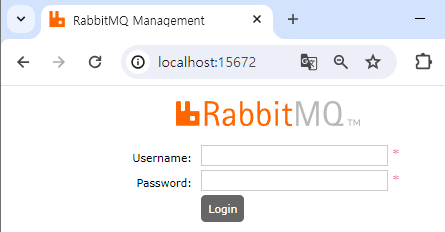
</div>
<br/>

### RabbitMQ 관리자 GUI

RabbitMQ 관리자 GUI는 RabbitMQ Server를 관리하고 모니터링하는 데 사용되는 웹 기반 인터페이스로 기존에 CLI로 작업했던 리소스 관리를 GUI 환경에서 쉽게 설정할 수 있다.  
 - Overview(개요): RabbitMQ 서버의 개요를 보여준다. 연결된 노드의 개수, 큐와  - 메시지의 수, 교환의 수 등을 포함한다.
 - Connections(연결): 클라이언트와 연결된 세션에 대한 정보를 보여준다. 여기서 연결을  - 끊을 수도 있다.
 - Channels(채널): 열려 있는 AMQP 채널의 목록을 표시하고, 채널당 메시지의 개수와  - 상태를 보여준다. 여기서 채널을 닫을 수도 있다.
 - Exchanges(교환): 정의된 모든 교환에 대한 정보를 보여준다. 교환의 유형, 바인딩된  - 큐의 수 등을 확인할 수 있다.
 - Queues(큐): 정의된 모든 큐에 대한 정보를 보여준다. 큐의 개수, 큐에 있는 메시지  - 수, 큐의 상태 등을 확인할 수 있다.
 - Admin(관리): 관리 작업을 수행하는 데 사용된다. 사용자, 가상 호스트, 권한 및 정책을 관리할 수 있다.

<div align="center">
    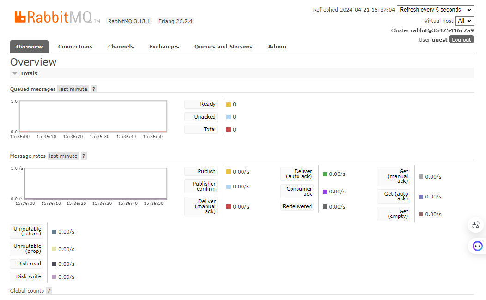
</div>
<br/>

### Exchange 화면

 - All exchanges: Exchange 목록을 확인할 수 있다. (교환의 유형, 바인딩된 큐의 수)
 - Add a new exchange: Exchange를 생성할 수 있다.

```bash
# 1. Exchange 목록 확인
$ rabbitmqctl list_exchanges
$ rabbitmqadmin list exchange

# 2. Exchange 만들기
$ rabbitmqadmin declare exchange name=my-new-exchange type=fanout
```

<div align="center">
    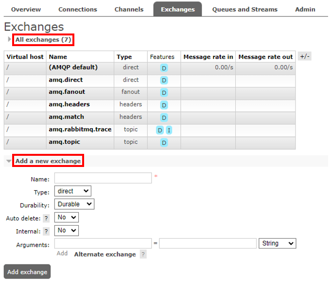
</div>
<br/>

### Queues and Streams 화면
 - All queues: Queue 목록을 확인할 수 있다. (큐의 개수, 큐에 있는 메시지 수, 큐의 상태)
 - Add a new queue: Queue를 생성할 수 있다.

```bash
# 1. Queue 목록 확인
$ rabbitmqctl list_queues
$ rabbitmqadmin list queues

# 2. Queue 만들기
$ rabbitmqadmin declare queue name=my_queue durable=true

# 3. Queue 제거
$ rabbitmqctl delete_queue my_queue
$ rabbitmqadmin delete queue name=my_queue
```

<div align="center">
    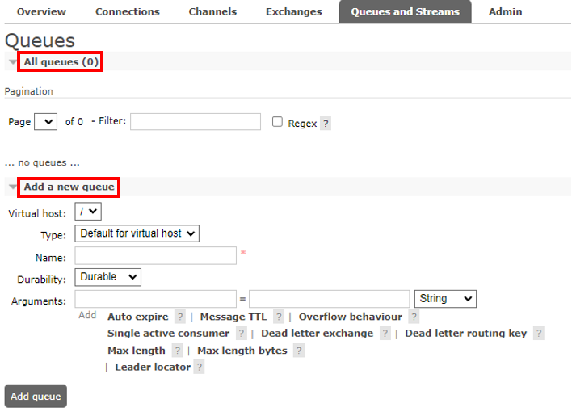
</div>
<br/>

 - Queue 상세 보기
    - Queue의 이름을 클릭하면 해당 Queue에 대한 상세 화면으로 이동한다.
    - 상세 화면에서 해당 Queue에 대한 통계를 확인할 수 있고, Consumers, Bindings 정보 확인과 메시지 발행, 메시지 읽기, 큐 삭제 등 작업을 할 수 있다.

<div align="center">
    <br/>
    
</div>
<br/>

### Admin 화면
 - All users: 계정 목록을 확인할 수 있다.
 - Add a user: 계정을 생성할 수 있다.
 - 좌측 메뉴(Users, Virtual Hosts, .. 등): 계정, 가상 호스트, 정책, 제한, 클러스터 등을 관리할 수 있다.

<div align="center">
    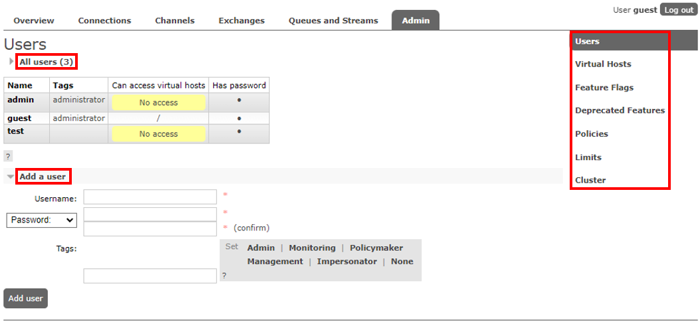
</div>
<br/>

## 4. RabbitMQ GUI 사용 예시

### 1. Exchange 만들기

쉬운 예시를 위해 Exchange 타입을 direct로 만든다. direct는 라우팅 키가 정확히 일치하는 Queue로 메시지가 전송된다.

<div align="center">
    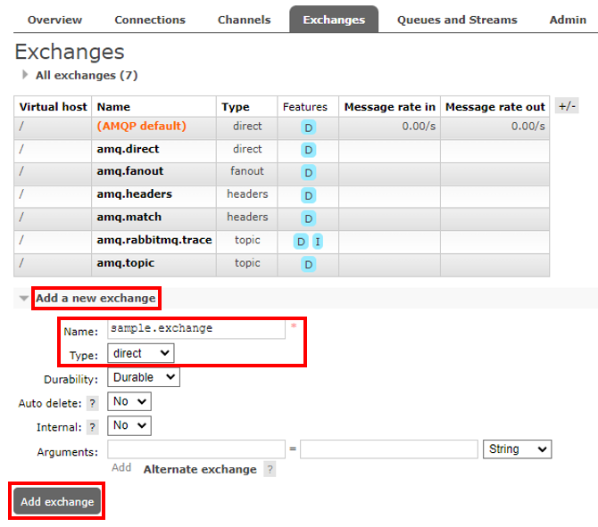
</div>
<br/>

### 2. Queue 만들기

메시지를 저장하고 Consumer에게 전달할 Queue를 생성한다.  
쉬운 예시를 위해 Classic 타입을 사용한다.  
 - __Classic Queue(클래식 큐)__
    - 가장 기본적인 큐 타입
    - 단일 노드에서만 작동하며, 메모리와 디스크를 사용하여 메시지를 저장한다. (고가용성을 보장하지 않음)
    - 단일 프로듀서와 단일 컨슈머 사이에서만 동작한다.
 - __Quorum Queue(쿼럼 큐)__
    - RabbitMQ 3.8+ 버전부터 지원
    - 클러스터 전체에 걸쳐 데이터를 복제하여 고가용성을 제공한다.
    - 여러 노드에 메시지를 복제하고 각 메시지에 대해 과반수 확인을 사용하여 안전성을 확보한다.
    - 대량의 메시지 처리에 적합하며, 클러스터의 장애 허용성을 향상시킨다.
 - __Stream Queue(스트림 큐)__
    - RabbitMQ 3.9+ 버전부터 지원
    - 대량 이벤트 스트림 처리를 위해 설계되었다.
    - 쿼럼 큐와 유사하지만, 주로 스트림 처리에 특화되어 있어 여러 컨슈머가 한 번에 메시지를 처리하는 경우에 유용하다.

<div align="center">
    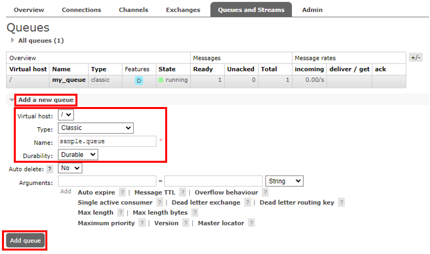
</div>
<br/>

### 3. Binding 설정

Exchange와 Queue 간의 연결을 정의한다.  
쉽게, Exchange는 Binding 규칙을 통해 어떤 Queue로 메시지를 보낼지 결정한다.  
 - Exchanages 화면으로 이동한 후 Exchange 이름을 클릭하여 상세 설정으로 이동할 수 있다.

<div align="center">
    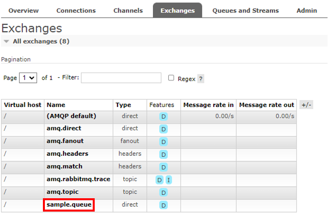
</div>
<br/>

 - __Bindings 옵션 설정__
    - To queue: sample.queue
    - Routing key: sample.exchange
    - 라우팅 키가 sample.exchange로 발행된 메시지가 "sample.queue" 라는 이름의 큐로 전달된다.
    - Exchange가 direct 타입으로 라우팅 키가 정확히 일치한 경우에만 해당 큐로 전달된다.

<div align="center">
    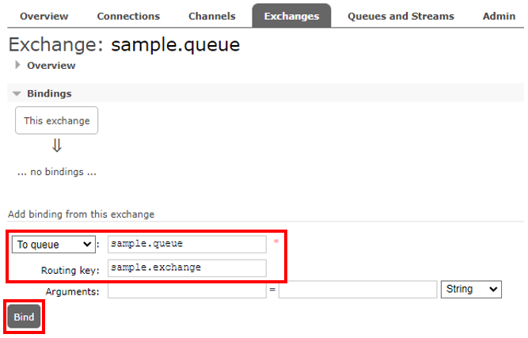
</div>
<br/>

 - __메시지 발행 테스트__
    - Publish message 에서 메시지를 발행해볼 수 있다.
    - 발행된 메시지의 Routing Key로 Exchange를 통해 연결된 큐가 있는 경우에는 성공하고, 매칭되는 큐가 없는 경우에는 실패한다.
        - 예제에서는 "sample.exchange"를 키로 교환기를 설정했다.
        - sample.exchange로 발행된 메시지는 큐에 전달된다.
        - sample.exchange.1, sample.exchange.abc 등은 실패한다. Exchange가 direct 타입으로 "sample.exchange.#" 으로 키를 잡아도 패턴 매칭이 아니라 실패한다. "sample.exchange.#" 으로 메시지가 발행되야 성공한다.

<div align="center">
    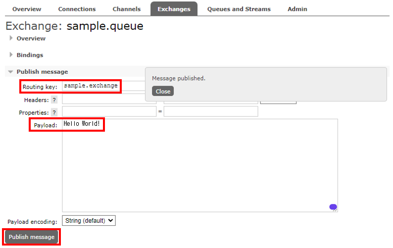<br/>
    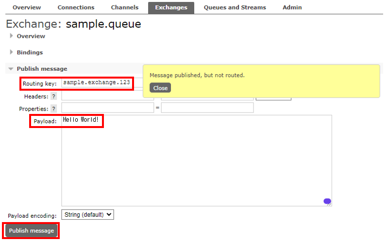
</div>
<br/>

 - __Queue 상태 및 메시지 확인__
    - Queues and Streams 메뉴에서 Queue 이름을 클릭하여 큐의 상세 화면을 확인할 수 있다.
    - Queue 상세 화면에서 실시간 통계를 그래프로 확인할 수 있다.
    - Get messages 화면에서 현재 Queue에 들어있는 메시지를 확인해볼 수 있다.

<div align="center">
    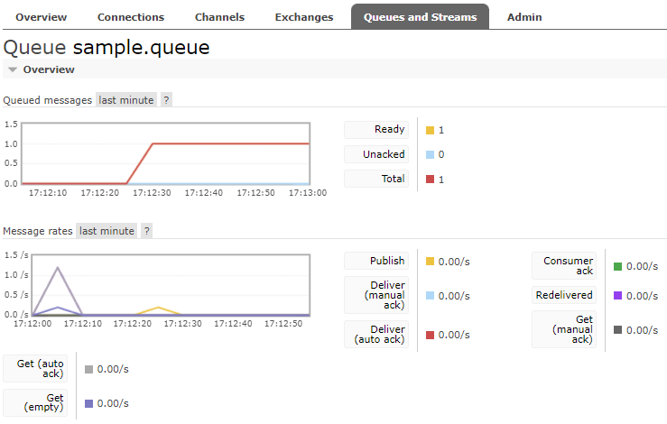<br/>
    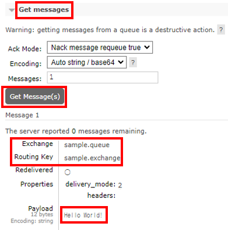
</div>
<br/>

