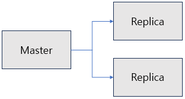
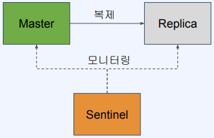
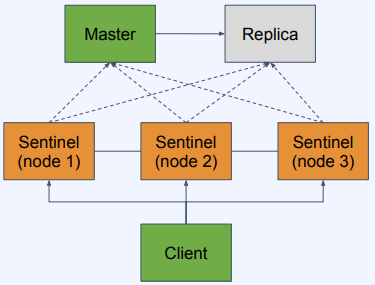

# Redis의 백업과 장애 복구

인메모리 안에 있는 Redis의 데이터를 디스크에 저장함으로써 영속성을 보장하도록 한다.  

<br/>

## RDB를 사용한 백업

RDB는 Redis Database의 약자로 특정 시점의 스냅샷으로 데이터를 저장한다.
 - 재시작 시 RDB 파일이 있으면 읽어서 복구
 - RDB 사용의 장점
    - 작은 파일 사이즈로 백업 파일 관리가 용이(원격지 백업, 버전 관리 등)
    - Form를 이용해 백업하므로 서비스 중인 프로세스는 성능에 영향 없음
    - 데이터 스냅샷 방식이므로 빠른 복구가 가능
 - RDB 사용의 단점
    - 스냅샷을 저장하는 시점 사이의 데이터 변경 사항은 유실될 수 있음
    - Fork를 이용하기 때문에 시간이 오래 걸릴 수 있고, CPU와 메모리 자원을 많이 소모
    - 데이터 무결성이나 정합성에 대한 요구가 크지 않은 경우 사용 가능 (마지막 백업 시 에러 발생 등의 문제)

<br/>

### RDB 설정

RDB는 기본적으로 설정 파일이 없어도 활성화되어 있다.  
설정 파일을 만들려면 템플릿을 받아서 사용 (https://redis.io/docs/management/config/)

 - 수동으로 스냅샷 저장
```Bash
$ redis-cli
127.0.0.1:6379> bgsave
```

 - redis.conf 파일
```
# 저장 주기 설정 (ex: 60초마다 10개 이상의 변경이 있을 떄 수행)
save 60 10

# 스냅샷을 저장할 파일 이름
dbfilename dump.rdb
```

 - Docker를 사용해 Redis 설정 파일 적용하기
    - 볼륨 마운트를 이용해 설정 파일을 마운트한다.
```Bash
$ docker run -v $(pwd)/redis.conf:/redis.conf --name my-redis-with-config redis redis-server /redis.conf
```

<br/>

## AOF를 사용한 백업

AOF는 Append Only File의 약자로 모든 쓰기 요청에 대한 로그를 저장하고, 재시작 시 AOF에 기록된 모든 동작을 재수행해서 데이터를 복구하는 방식이다.  
Redis의 변경 사항이 있을 때마다 모든 로그가 기록(ex:appendonly.aof)되고, Redis 재실행시 모든 Operation을 재실행한다.  
AOF 백업으 설정하기 위해서는 Redis 설정 파일(redis.conf)에 appendonly yes 옵션을 활성화해야 한다.  
 - 명령 기록: Redis는 수행되는 모든 쓰기 명령을 AOF 파일에 기록합니다. 이 파일은 단순한 텍스트 파일로서, Redis 서버가 받는 각 쓰기 명령이 해당 파일에 추가되어 나열됩니다.
 - Append-Only 방식: Redis는 AOF 파일에 새 명령을 추가하는 방식으로 기록합니다. 기존 데이터를 수정하거나 삭제하는 작업이 아니라, 새로운 명령을 순차적으로 파일에 덧붙이는 방식입니다.
 - 재실행: Redis는 AOF 파일을 사용하여 데이터베이스를 복구할 수 있습니다. Redis 서버가 시작될 때 AOF 파일을 읽어 해당 파일에 포함된 모든 명령을 재실행하여 데이터를 복원합니다.
 - AOF 사용의 장점
    - 모든 변경 사항이 기록되므로 RDB 방식 대비 안정적으로 데이터 백업 가능
    - AOF 파일은 append-only 방식이므로 백업 파일이 손상될 위험이 적음
    - 실제 수행된 명령어가 저장되어 있으므로 사람이 보고 이해할 수 있고 수정도 가능
 - AOF 사용의 단점
    - RDB 방식보다 파일 사이즈가 크다. (모든 로그 저장)
    - RDB 방식 대비 백업&복구 속도가 느리다. (백업 성능은 fsync 정책에 따라 조절 가능)

<br/>

### AOF 관련 개념

 - Log rewriting
    - 최종 상태를 만들기 위한 최소한의 로그만 남기기 위해 일부로 새로 씀
    - ex: 1개의 key값을 100번 수정해도 최종 상태는 1개이므로 SET 1개로 대체 가능
 - Multi Part AOF
    - Redis 7.0부터 AOF가 단일 파일에 저장되지 않고 여러 개가 사용됨
    - base file: 마지막 rewrite 시의 스냅샷을 저장
    - incremental file: 마지막으로 base file이 생성된 이후의 변경 사항이 쌓임
    - manifest file: 파일들을 관리하기 위한 메타 데이터를 저장

<br/>

 - redis.conf
    - fsync 정책
        - fsync() 호출은 OS에게 데이터를 디스크에 쓰도록 한다.
        - always: 새로운 커맨드가 추가될 때마다 수행. 가장 안전하지만 가장 느리다.
        - everysec: 1초마다 수행. 성능은 RDB 수준에 근접하다.
        - no: OS에 맡김. 가장 빠르지만 덜 안전하다. (커널마다 수행 시간이 다를 수 있음)
```conf
# AOF 사용 (기본값은 no)
appendonly yes

# AOF 파일 이름
appendfilename appendonly.aof

# fsync 정책 설정 (always, everysec, no)
appendfsync everysec
```

<br/>

## Redis의 복제

Redis Replication(복제)는 Redis의 데이터를 다른 Redis 인스턴스로 복사하는 메커니즘을 말한다. 복제는 데이터의 가용성을 높이고 장애 복구를 강화하기 위해 사용된다. 주요한 목표는 마스터 Redis 서버의 데이터를 슬레이브 Redis 서버에 복제하여 데이터를 안전하게 유지하는 것이다.  
 - 백업만으로는 장애 대비에 부족함(백업 실패 가능성, 복구에 소요되는 시간)
 - Redis도 복제를 통해 가용성을 확보하고 빠른 장애 조치가 가능
 - Master가 죽었을 경우 Replica 중 하나를 Master로 전환해 즉시 서비스 정상화 가능
 - 복제본(Replica)은 read-only 노드로 사용 가능하므로 트래픽 분산도 가능

<p style="text-align: center;">
     
</p>

<br/>

### Redis 복제 특징

 - 마스터-슬레이브 관계: Redis 복제는 마스터(데이터를 제공하는 서버)와 하나 이상의 슬레이브(데이터를 수신하는 서버) 간의 관계를 형성합니다.
 - 비동기적 복제: 슬레이브 서버는 마스터 서버로부터 데이터를 비동기적으로 받아옵니다. 이를 통해 슬레이브 서버의 부하를 줄이고 응답성을 향상시킬 수 있습니다.
 - 데이터 지속성: 슬레이브 서버는 마스터 서버로부터 전달된 데이터를 사용하여 자체 데이터베이스를 유지합니다. 이로써 데이터 지속성이 보장됩니다.
 - 장애 복구: 마스터 서버의 데이터베이스가 손상되거나 실패한 경우, 슬레이브 서버 중 하나를 새로운 마스터로 승격시켜 서비스를 계속할 수 있습니다.
 - 읽기 부하 분산: 슬레이브 서버는 읽기 연산을 처리하는 데 사용될 수 있으며, 이를 통해 읽기 부하를 분산시킬 수 있습니다.

<br/>

### Redis 복제 사용

Redis 복제를 사용하기 위해서는 Replica 노드(슬레이브 서버)에서 설정을 적용해야 한다.  
추가적으로 복제를 사용하는 경우 Master 노드에는 RDB나 AOF를 이용한 백업 기능 활성화가 필요하다.  
그 이유는 백업이 안되어 있으면 Master 노드가 재실행될 때 데이터가 없는 상태로 실행되는데, 이떄 Master 노드가 되살아나서 Replica 노드는 데이터가 없는 Master 노드를 복제하게 되어 문제가 발생하게 된다.

 - redis.conf
    - replicaof 옵션을 통해 마스터 서버의 주소와 포트를 지정한다.
    - replica-read-only 옵션을 정의하면 Replica가 read-only로 설정된다.
```conf
# Replica로 동작하도록 설정
replicaof <마스터 IP> <마스터 포트>

# Replica를 read-only로 설정
replica-read-only
```

 - Docker로 Redis 복제 실행
```Bash
# Master 노드 실행
$ docker run --name my-redis-master -p 5000:6379 redis

# Replica 노드 실행
# redis.conf에 "replicaof 127.0.0.1 5000" 옵션을 정의한다.
$ docker run --network host -v $(pwd)/redis.conf:redis.conf --name my-redis-replica redis redis-server /redis.conf
```

 - Docker Compose로 Redis 복제 실행
    - Docker Compose는 여러 개의 컨테이너로 구성된 애플리케이션을 정의하고 실행할 수 있는 도구로 YAML 파일을 통해 설정할 수 있다.
    - $ docker-compose up --build
```YML
version: "3"
services: 
  my-redis-a:
    hostname: redis-master
    container_name: redis-master
    image: "bitnami/redis"
    environment:
      - REDIS_REPLICATION_MODE=master
      - ALLOW_EMPTY_PASSWORD=yes
    ports:
      - 5000:6379 
  my-redis-b:
    hostname: redis-replicas-1
    container_name: redis-replicas-1
    image: "bitnami/redis"
    environment:
      - REDIS_REPLICATION_MODE=slave
      - REDIS_MASTER_HOST=redis-master
      - ALLOW_EMPTY_PASSWORD=yes
    ports:
      - 5001:6379
    depends_on:
      - my-redis-a
```

<br/>

## Redis Sentinel을 이용한 자동 장애 조치

Redis Sentinel은 Redis 데이터베이스의 고가용성(High Availability)와 장애 감지 및 자동 장애 복구를 지원하기 위한 도구입니다. Sentinel은 마스터-슬레이브 복제를 관리하고 모니터링하며, 마스터 서버의 장애를 감지하고 자동으로 슬레이브 서버를 새로운 마스터로 승격시키는 등의 작업을 수행합니다.  
 - Redis에서 HA(High Availability)를 제공하기 위한 장치
 - Master-Replica 구조에서 Master가 다운 시 Replica를 Master로 승격시키는 Auto-Failover를 수행
 - Sentinel의 기능: 모니터링, 알림, 자동 장애 복구, 환경 설정 제공자

<p style="text-align: center;">
     
</p>

<br/>

### Redis Sentinel 주요 기능과 동작 방식

 - 고가용성 관리
    - Redis Sentinel은 마스터-슬레이브 복제를 관리하여 마스터 서버의 장애로부터 데이터의 가용성을 보장합니다. 여러 슬레이브 서버 중에서 새로운 마스터 서버를 선정하여 서비스를 계속할 수 있도록 합니다.
 - 장애 감지 및 자동 복구
    - Sentinel은 마스터 서버의 상태를 주기적으로 모니터링하고 장애를 감지하면 자동으로 슬레이브 서버 중 하나를 새로운 마스터로 승격시켜 데이터베이스의 지속적인 가용성을 보장합니다.
 - 마스터 서버 선출
    - 마스터 서버의 장애가 발생하면 Sentinel은 슬레이브 서버 중 하나를 새로운 마스터로 선출하는 작업을 수행합니다.
 - 오토 페일오버
    - 장애가 복구되면 이전에 마스터 역할을 했던 서버를 다시 슬레이브로 복구시키고, 마스터 역할을 재할당합니다.
 - 다양한 모니터링 정보 제공
    - Sentinel은 각 마스터 및 슬레이브 서버의 상태, 구성 정보, 감지된 장애 및 변경 사항에 대한 정보를 제공합니다.

<br/>

### Redis Sentinel 실제 구성

Redis Sentinel은 보통 홀로 운영되기보다 여러 Sentinel 인스턴스가 클러스터를 형성하여 고가용성을 높이는 방식으로 활용됩니다.  
 - Sentinel 노드는 3개 이상으로 구성(Quorum 떄문)
 - Sentinel 들은 서로 연결되어 있음
 - Sentinel 들은 Redis Master와 Replica 모두를 모니터링
 - Client는 Sentinel을 통해 Redis에 접근하게 됨

<p style="text-align: center;">
     
</p>

<br/>

### Redis Sentinel 특징

 - SDOWN(Subjective down)과 ODOWN(Objective down) 2가지 판단이 있음
    - SDOWN: Sentinel 1대가 down으로 판단 (주관적)
    - ODOWN: 정족수가 충족되어 down으로 판단 (객관적)
 - Master 노드가 down 된 걸로 판단되기 위해서는 Sentinel 노드들이 정족수(Quorum)을 충족해야 함
 - 클라이언트는 Sentinel을 통해 Master의 주소를 얻어내야 함

<br/>

### Docker Compose로 Redis 복제 실행

 - docker-compose.yml
```YML
version: "3"
services: 
  my-redis-a:
    hostname: redis-master
    container_name: redis-master
    image: "bitnami/redis"
    environment:
      - REDIS_REPLICATION_MODE=master
      - ALLOW_EMPTY_PASSWORD=yes
    ports:
      - 5000:6379 
  my-redis-b:
    hostname: redis-replicas-1
    container_name: redis-replicas-1
    image: "bitnami/redis"
    environment:
      - REDIS_REPLICATION_MODE=slave
      - REDIS_MASTER_HOST=redis-master
      - ALLOW_EMPTY_PASSWORD=yes
    ports:
      - 5001:6379
    depends_on:
      - my-redis-a

  redis-sentinel-1:
    container_name: sentinel1
    image: 'bitnami/redis-sentinel:latest'
    environment:
      - REDIS_SENTINEL_DOWN_AFTER_MILLISECONDS=3000
      - REDIS_MASTER_HOST=redis-master
      - REDIS_MASTER_PORT_NUMBER=6379
      - REDIS_MASTER_SET=mymaster
      - REDIS_SENTINEL_QUORUM=2
    ports:
      - 26379:26379
    depends_on:
      - my-redis-a
      - my-redis-b
  redis-sentinel-2:
    container_name: sentinel2
    image: 'bitnami/redis-sentinel:latest'
    environment:
      - REDIS_SENTINEL_DOWN_AFTER_MILLISECONDS=3000
      - REDIS_MASTER_HOST=redis-master
      - REDIS_MASTER_PORT_NUMBER=6379
      - REDIS_MASTER_SET=mymaster
      - REDIS_SENTINEL_QUORUM=2
    ports:
      - 26380:26379
    depends_on:
      - my-redis-a
      - my-redis-b
  redis-sentinel-3:
    container_name: sentinel3
    image: 'bitnami/redis-sentinel:latest'
    environment:
      - REDIS_SENTINEL_DOWN_AFTER_MILLISECONDS=3000
      - REDIS_MASTER_HOST=redis-master
      - REDIS_MASTER_PORT_NUMBER=6379
      - REDIS_MASTER_SET=mymaster
      - REDIS_SENTINEL_QUORUM=2
    ports:
      - 26381:26379
    depends_on:
      - my-redis-a
      - my-redis-b
```
 - Sentinel 컨테이너 접속 후 Sentinel에 접속
    - 이전에 docker-compose up --build 명령어로 Master와 Replica 노드, Sentinel을 실행한다.
```Bash
$ docker exec -it sentinel1 /bin/sh
$ redis-cli -p 26379

# Sentinel 상태 조회
127.0.0.1:26379> info sentinel

# 다른 프롬프트로 Master 컨테이너 종료
$ docker stop redis-master

# Sentinel 상태 조회: Master -> Replica 노드 서버로 변경됨
127.0.0.1:26379> info sentinel

# 다른 프롬프트로 Master 컨테이너 재실행
# 이미 Replica 노드가 Master로 승격되어, 해당 컨테이너가 Slave로 동작한다.
$ docker start redis-master
```

 - Client에서 사용 (Spring Data Redis 예시)
    - Sentinel을 통해서 Redis에 접속하도록 정상 동작이 되고, 실제 Redis 접근 코드는 변경 사항이 없음
```YML
spring:
  redis:
    sentinel:
      master: mymaster
      nodes: 127.0.0.1:26379, 127.0.0.1:26380, 127.0.0.1:26381
```