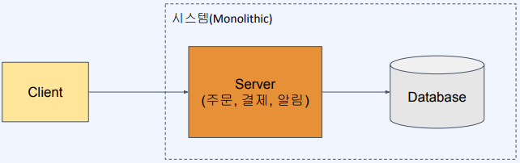
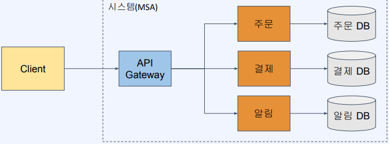
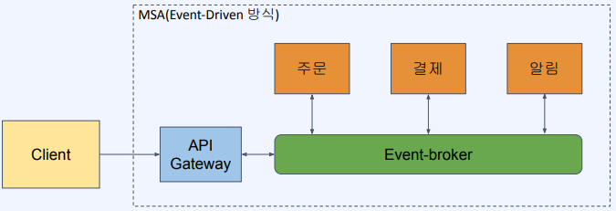
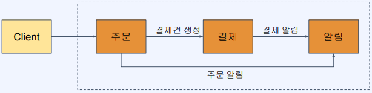
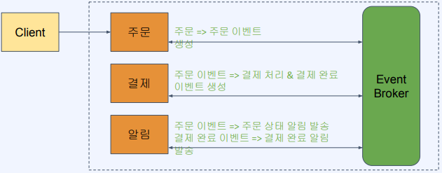
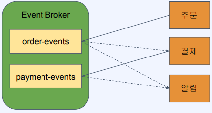

# Redis Streams를 이용한 Event-Driven 아키텍처

## MSA와 Event-Driven 아키텍처

MSA는 "Microservices Architecture"의 약어로, 마이크로서비스 아키텍처를 나타냅니다. MSA는 소프트웨어 개발 및 배포 방식으로서, 큰 애플리케이션을 작은 단위로 분할하여 개발하고 운영하는 아키텍처 패턴입니다.  
시스템을 독립적인 단위의 작은 서비스들로 분리하며, 각 서비스들이 사용하는 DB도 분리한다. 또한, 각 서비스들은 API(인터페이스)를 통해서만 통신한다.(다른 서비스의 DB 접근 불가)
 - 마이크로서비스:
    - 애플리케이션을 작은 단위로 나눈 독립적인 서비스로 구성됩니다. 각 마이크로서비스는 특정 비즈니스 기능을 담당하며, 서로 독립적으로 개발, 배포, 운영됩니다.
 - 독립성:
    - 각 마이크로서비스는 독립된 프로세스로 실행되므로, 하나의 서비스의 장애가 다른 서비스에 영향을 미치지 않습니다.
 - 경량성:
    - 마이크로서비스는 작은 규모로 유지되므로 더 가볍고 빠르게 개발하고 배포할 수 있습니다.
 - 다양한 기술 선택:
    - 각 마이크로서비스는 독립적이므로 서로 다른 기술 스택과 언어를 선택하여 개발할 수 있습니다.
 - 단일 책임 원칙:
    - 각 마이크로서비스는 하나의 특정 기능을 담당하므로 단일 책임 원칙에 따라 설계됩니다.
 - API 기반 통신:
    - 마이크로서비스 간에 통신은 API를 기반으로 이루어집니다. 각 서비스는 자체적으로 API를 노출하여 상호 작용합니다.
 - 분산 데이터 관리:
    - 데이터베이스와 같은 데이터 관리도 마이크로서비스마다 독립적으로 이루어집니다. 각 서비스는 자체 데이터 스토어를 가지거나 공유 데이터베이스를 사용할 수 있습니다.
 - 운영 및 관리의 독립성:
    - 각 마이크로서비스는 독립적으로 배포되며, 개별적으로 확장하고 업데이트할 수 있습니다.
 - MSA의 이점
    - 모듈성(높은 응집도, 낮은 결합도)
    - 서비스별로 독립적인 개발과 배포 가능
    - 서비스(코드) 크기가 작아져 이해가 쉽고 유지보수가 용이
    - 더 빠른 개발, 테스트, 배포
    - 확장성(서비스별로 개별 확장이 가능)
    - 결함 격리(일부 서비스 실패가 전체 시스템 실패로 이어지지 않음)
 - MSA의 단점
    - 분산 시스템의 단점을 그대로 가짐
    - 통합 테스트의 어려움
    - 모니터링과 디버깅의 복잡도 증가
    - 트랜잭션 관리의 어려움(DB가 나뉘어져있다.)
    - 서비스간 통신 구조에 대한 고민이 필요(동기와 비동기, 프로토콜(HTTP, GRPC), 통신 브로커)

<p style="text-align: center;">
     
</p>
<p style="text-align: center;">
    Monolithic 시스템 아키텍처 <br/>
    모든 기능들이 한 서버 안에 들어가 있고, 공유 데이터베이스를 사용
</p>
<p style="text-align: center;">
     
</p>
<p style="text-align: center;">
    MSA 시스템 아키텍처 <br/>
    기능(도메인) 별로 서버가 나뉘어 있고, 각자의 데이터베이스를 사용하며 API를 이용해 통신
</p>

<br/>

### Event-Driven 아키텍처

Event-Driven 아키텍처는 시스템 내에서 발생하는 이벤트와 이벤트의 처리에 중점을 둔 소프트웨어 아키텍처 패턴입니다. 이벤트-주도 아키텍처 또는 이벤트-소싱 아키텍처라고도 불립니다. 이 패턴은 시스템을 느슨하게 결합된 컴포넌트들로 구성하며, 각 컴포넌트는 이벤트를 생성하고 수신하며, 필요에 따라 이벤트를 처리하고 반응합니다.  
 - 분산 시스템에서의 통신 방식을 정의한 아키텍처로 이벤트의 생성/소비 구조로 통신이 이루어짐
 - 각 서비스들은 이벤트 저장소인 Event-Broker와의 의존성만 가짐
 - 각 서버들은 Event Broker에 이벤트를 생산/소비함으로써 통신
 - Event-Driven 아키텍처의 장점
    - 이벤트 생산자/소비자 간의 결함도가 낮아짐(공통적인 Event Broker에 대한 결합만 있음)
    - 생산자/소비자의 유연한 변경(서버 추가, 삭제 시에 다른 서버를 변경할 필요가 적어짐)
    - 장애 탄력성(이벤트를 소비할 일부 서비스에 장애가 발생해도 이벤트는 저장되고 이후에 처리됨)
 - Event-Driven 아키텍처의 단점
    - 시스템의 예측 가능성이 떨어짐(느슨하게 연결된 상호작용에서 기인함)
    - 테스트의 어려움
    - 장애 추적의 어려움

<p style="text-align: center;">
     
</p>

<br/>

## Redis Streams의 이해

Redis Streams는 Redis의 데이터 구조 중 하나로, 순서가 있는 데이터 스트림을 저장하고 처리하기 위한 기능을 제공하는 데이터 타입입니다. Streams는 이벤트 로깅, 메시지 큐, 데이터 스트리밍 등 다양한 시나리오에서 사용될 수 있습니다.  
 - append-only log를 구현한 자료 구조
 - 하나의 Key로 식별되는 하나의 Stream에 엔트리가 계속 추가되는 구조
 - 하나의 엔트리는 Entry ID + (key-value 리스트)로 구성
 - 추가된 데이터는 사용자가 삭제하지 않는 한 지워지지 않음
 - Redis Streams 활용
    - 센서 모니터링(지속적으로 변하는 데이터인 시간 별 나맀 수집 등)
    - 유저별 알림 데이터 저장
    - 이벤트 저장소

<br/>

### Redis Streams 명령어

다중 프로듀서와 컨슈머의 특징을 가져 하나의 스트림은 여러 프로듀서가 데이터를 추가하고 여러 컨슈머가 데이터를 읽을 수 있는 구조를 가진다.  
컨슈머 그룹을 생성하여 그룹 내의 여러 컨슈머가 동일한 이벤트를 동시에 처리하도록 할 수 있다.  

 - 엔트리 읽기(범위 기반)
    - XRANGE [key] [start] [end]
        - 특정 ID 범위의 엔트리를 반환한다.
 - 엔트리 읽기(Offset 기반)
    - XREAD BLOCK [milliseconds] STREAMS [key] [id]
        - 한 개 이상의 Key에 대해 특정 ID 이후의 엔트리를 반환한다.
 - Consumer Group
    - 한 Stream을 여러 Consumer가 분산 처리할 수 있는 방식으로 하나의 그룹에 속한 Consumer는 서로 다른 엔트리들을 조회하게 된다.
    - XGROUP CREATE [key] [group name] [id]
        - 컨슈머 그룹을 생성한다.
    - XREADGROUP GROUP [group name] [consumer name] COUNT [count] STREAMS [key] [id]
        - 특정 Key의 Stream을 조회하되, 특정 consumer group에 속한 consumer로 읽음
```Bash
# XADD: 엔트리 추가
## user-notifications라는 Stream에 1개의 엔트리를 추가하며 2개의 field-value 쌍을 넣는다.
127.0.0.1:6379> XADD user-notifications * user-a hi user-b hello

# XRANGE: 엔트리 읽기(범위기반)
## user-notifications의 모든 범위를 조회
127.0.0.1:6379> XRANGE user-notifications - +

# XREAD: 엔트리 읽기(Offset 기반)
## user-notifications의 0보다 큰 ID 조회
127.0.0.1:6379> XREAD BLOCK 0 STREAMS user-notifications 0
## user-notifications에서 새로 들어오는 엔트리를 동기 방식으로 조회
## 앞으로 들어올 데이터를 동기 방식으로 조회하여 Event Listener와 같은 방식으로 사용 가능
127.0.0.1:6379> XREAD BLOCK 0 STREAMS user-notifications $

# XGROUP CREATE: 컨슈머 그룹 생성
## user-notifications에 group1 이라는 컨슈머 그룹 생성
127.0.0.1:6379> XGROUP CREATE user-notifications group1 $

# XREADGROUP GROUP: 특정 컨슈머 그룹에 속한 컨슈머로 읽기
## user-notifications에서 group1 그룹으로 2개의 컨슈머가 각각 1개씩 조회
127.0.0.1:6379> XREADGROUP GROUP group1 consumer1 COUNT 1 STREAMS user-notifications >
127.0.0.1:6379> XREADGROUP GROUP group1 consumer2 COUNT 1 STREAMS user-notifications >
```

<br/>

## Redis Streams를 이용한 이벤트 기반 통신 개발

### HTTP 통신과 Event Drivent 통신 방식

<p style="text-align: center;">
     
</p>
<p style="text-align: center;">
    MSA HTTP 통신 방식 <br/>
    각 서비스는 필요한 서비스를 직접 호출
</p>
<p style="text-align: center;">
     
</p>
<p style="text-align: center;">
    MSA Event Driven 통신 방식 <br/>
    각 서비스는 미리 정의된 이벤트를 소비/생성함으로써 통신
</p>

<br/>

### Event Driven 실습 예제

 - order-events: 주문이 완료되면 발행
 - payment-events: 결제가 완료되면 발행

<p style="text-align: center;">
     
</p>

<br/>

### 프로젝트 소스 코드

 - 3개의 프로젝트가 생성된다.
    - 주문을 처리하는 OrderService
        - 주문 요청을 처리하고, order-events 스트림에 데이터를 추가하여 결제가 진행되도록 한다.
    - 결제를 처리하는 PaymentService
        - StreamListener로 동작한다. order-events 스트림에 데이터가 추가되면 동작하며, 결제 요청을 처리하고, payment-events 스트림에 데이터를 추가하여 알림이 진행되도록 한다.
    - 알림을 처리하는 NotificationService
        - order-events 스트림에 데이터가 추가되면 동작하며, 주문 건에 대한 메일 발송을 처리한다.
        - payment-events 스트림에 데이터가 추가되면 동작하며, 결제 완료 건에 대한 메일 발송을 처리한다.

<br/>

 - build.gradle
    - Redis 관련 의존성 라이브러리는 모두 같다.
```
dependencies {
	implementation 'org.springframework.boot:spring-boot-starter-data-redis'
	implementation 'org.springframework.boot:spring-boot-starter-web'
	testImplementation 'org.springframework.boot:spring-boot-starter-test'
}
```

 - application.yml
    - Redis 서버 정보는 모두 공통으로 사용하고, 애플리케이션의 포트 번호를 각각 다르게 설정한다.
```YML
spring:
  redis:
    host: localhost
    port: 6379

server:
  port: ${포트 번호}
```

<br/>

### OrderService 프로젝트

 - OrderController
    - 주문 요청을 받는 API
    - 주문 요청을 처리하고, order-events 스트림에 데이터를 추가한다.
```Java
@RestController
public class OrderController {

    @Autowired
    StringRedisTemplate redisTemplate;

    @GetMapping("/order")
    public String order(
            @RequestParam String userId,
            @RequestParam String productId,
            @RequestParam String price
    ) {

        Map fieldMap = new HashMap<String, String>();
        fieldMap.put("userId", userId);
        fieldMap.put("productId", productId);
        fieldMap.put("price", price);

        redisTemplate.opsForStream().add("order-events", fieldMap);

        System.out.println("Order created.");
        return "ok";
    }
}
```

<br/>

### PaymentService

order-events를 수신하여 결제를 처리하고, 새로운 payment-events를 생성한다.  

 - OrderEventStreamListener
    - order-events의 스트림에서 메시지를 수신하였을 때, 결제 요청을 처리하고, payment-events 스트림에 데이터를 추가한다.
    - StreamListener 인터페이스의 onMessage 메서드를 구현하면 안에서 메시지 수신시 처리를 정의할 수 있다.
```Java
@Component
public class OrderEventStreamListener implements StreamListener<String, MapRecord<String, String, String>> {

    int paymentProcessId = 0;

    @Autowired
    StringRedisTemplate redisTemplate;

    @Override
    public void onMessage(MapRecord<String, String, String> message) {
        Map map = message.getValue();

        String userId = (String) map.get("userId");
        String productId = (String) map.get("productId");
        String price = (String) map.get("price");

        // 결제 관련 로직 처리
        // ...

        String paymentIdStr = Integer.toString(paymentProcessId++);

        // 결제 완료 이벤트 발행
        Map fieldMap = new HashMap<String, String>();
        fieldMap.put("userId", userId);
        fieldMap.put("productId", productId);
        fieldMap.put("price", price);
        fieldMap.put("paymentProcessId", paymentIdStr);

        redisTemplate.opsForStream().add("payment-events", fieldMap);

        System.out.println("[Order consumed] Created payment: " + paymentIdStr);
    }
}
```

 - RedisStreamConfig
    - StreamMessageListenerContainer를 만들고, order-events 스트림에 대해 메시지 수신시 처리되는 리스너를 등록한다.
    - listenerContainer.receiveAutoAck()
        - 메시지를 수신하면서 처리한 것으로 표시한다. 같은 엔트리 이벤트가 다른 컨슈머 그룹에서 읽히지 않도록 해당 메서드를 이용한다.
    - Consumer.from("payment-service-group", "instance-1")
        - 컨슈머 그룹은 "payment-service-group"으로 하고, 컨슈머는 "instance-1"로 한다.
    - StreamOffset.create("order-events", ..), orderEventStreamListener
        - "order-events" 스트림에 데이터가 수신되면 orderEventStreamListener 리스너를 수행한다.
    - ※ 애플리케이션이 올라가기 전에 "payment-service-group" 컨슈머 그룹이 등록되어야 한다.
        - XGROUP CREATE order-events payment-service-group $ MKSTREAM
```Java
@Configuration
public class RedisStreamConfig {

    @Autowired
    private OrderEventStreamListener orderEventStreamListener;

    @Bean
    public Subscription subscription(RedisConnectionFactory factory) {
        StreamMessageListenerContainer.StreamMessageListenerContainerOptions options = StreamMessageListenerContainer
                .StreamMessageListenerContainerOptions
                .builder()
                .pollTimeout(Duration.ofSeconds(1))
                .build();

        StreamMessageListenerContainer listenerContainer = StreamMessageListenerContainer.create(factory, options);

        Subscription subscription = listenerContainer.receiveAutoAck(Consumer.from("payment-service-group", "instance-1"),
                StreamOffset.create("order-events", ReadOffset.lastConsumed()), orderEventStreamListener);

        listenerContainer.start();
        return subscription;
    }
}
```

<br/>

### NotificationService

고객에게 알림을 전송하는 프로젝트로 order-events를 수신하면 주문 요청 메일을 전송하고, payment-events를 수신하면 결제 완료 메일을 전송한다.  

 - OrderEventStreamListener
    - StreamListener 인터페이스의 onMessage 메서드를 구현하면 안에서 메시지 수신시 처리를 정의할 수 있다.
    - order-events의 스트림에서 메시지를 수신하였을 때, 주문 건에 대한 메일을 발송한다.
```Java
@Component
public class OrderEventStreamListener implements StreamListener<String, MapRecord<String, String, String>> {

    @Override
    public void onMessage(MapRecord<String, String, String> message) {
        Map map = message.getValue();

        String userId = (String) map.get("userId");
        String productId = (String) map.get("productId");

        // 주문 건에 대한 메일 발송 처리
        System.out.println("[Order consumed] usrId: " + userId + "   productId: " + productId);
    }
}
```

 - PaymentEventStreamListener
    - StreamListener 인터페이스의 onMessage 메서드를 구현하면 안에서 메시지 수신시 처리를 정의할 수 있다.
    - payment-events의 스트림에서 메시지를 수신하였을 때, 결제 완료 건에 대한 메일을 발송한다.
```Java
@Component
public class PaymentEventStreamListener implements StreamListener<String, MapRecord<String, String, String>> {

    @Override
    public void onMessage(MapRecord<String, String, String> message) {
        Map map = message.getValue();

        String userId = (String) map.get("userId");
        String paymentProcessId = (String) map.get("paymentProcessId");

        // 결제 완료 건에 대해 SMS 발송 처리
        System.out.println("[Payment consumed] usrId: " + userId + "   paymentProcessId: " + paymentProcessId);
    }
}
```

 - RedisStreamConfig
    - order-events와 payment-events 스트림에 대해 메시지 수신시 처리되는 리스너를 등록한다.
    - ※ 애플리케이션이 올라가기 전에 "notification-service-group" 컨슈머 그룹이 등록되어야 한다.
        - XGROUP CREATE payment-events notification-service-group $ MKSTREAM
        - XGROUP CREATE order-events notification-service-group $ MKSTREAM
```Java
@Configuration
public class RedisStreamConfig {

    @Autowired
    private OrderEventStreamListener orderEventStreamListener;

    @Autowired
    private PaymentEventStreamListener paymentEventStreamListener;

    @Bean
    public Subscription orderSubscription(RedisConnectionFactory factory) {
        StreamMessageListenerContainer.StreamMessageListenerContainerOptions options = StreamMessageListenerContainer
                .StreamMessageListenerContainerOptions
                .builder()
                .pollTimeout(Duration.ofSeconds(1))
                .build();

        StreamMessageListenerContainer listenerContainer = StreamMessageListenerContainer.create(factory, options);

        Subscription subscription = listenerContainer.receiveAutoAck(Consumer.from("notification-service-group", "instance-1"),
                StreamOffset.create("order-events", ReadOffset.lastConsumed()), orderEventStreamListener);

        listenerContainer.start();
        return subscription;
    }

    @Bean
    public Subscription paymentSubscription(RedisConnectionFactory factory) {
        StreamMessageListenerContainer.StreamMessageListenerContainerOptions options = StreamMessageListenerContainer
                .StreamMessageListenerContainerOptions
                .builder()
                .pollTimeout(Duration.ofSeconds(1))
                .build();

        StreamMessageListenerContainer listenerContainer = StreamMessageListenerContainer.create(factory, options);

        Subscription subscription = listenerContainer.receiveAutoAck(Consumer.from("notification-service-group", "instance-1"),
                StreamOffset.create("payment-events", ReadOffset.lastConsumed()), paymentEventStreamListener);

        listenerContainer.start();
        return subscription;
    }
}
```