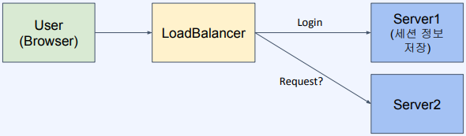
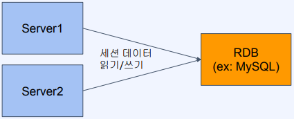
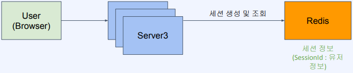

# 분산 환경에서의 세션 스토어 만들기

## 세션(Session)

세션(Session)은 컴퓨터 과학 및 정보 기술 분야에서 널리 사용되는 개념으로, 사용자 또는 시스템과의 상호 작용을 통해 유지되는 상태 정보의 일부를 나타냅니다. 세션은 웹 애플리케이션, 네트워크 프로토콜, 데이터베이스 관리, 보안 등 다양한 분야에서 사용됩니다.  
 - 네트워크 상에서 두 개 이상의 통신장치간에 유지되는 상호 연결
 - 연결된 일정 시간 동안 유지되는 정보를 나타냄
 - 적용 대상에 따라 다른 의미를 가짐

<br/>

## Web 로그인 세션

웹 로그인 세션은 웹 애플리케이션에서 사용자 인증을 관리하고 사용자의 로그인 상태를 유지하기 위해 사용되는 세션입니다.  
사용자가 로그인하면 서버 측에서 해당 사용자의 정보와 인증 상태를 기록하고 관리하는데 사용됩니다.  
이것은 사용자가 웹 사이트에서 계속적으로 활동하거나 다양한 페이지를 탐색하는 동안 로그인 상태를 유지하기 위한 중요한 메커니즘입니다.  
 - Web 상에서 특정 유저가 로그인했음을 나타내는 정보
 - 브라우저는 Cookie를, 서버는 해당 Cookie에 연관된 세션 정보를 저장한다.
 - 유저가 로그아웃하거나 세션이 만료될 때 까지 유지되어 유저에 특정한 서비스 가능

<br/>

## 분산 환경에서의 세션 처리

분산 환경에서는 여러 서버가 동시에 작동하고 요청을 처리하므로, 사용자의 세션 데이터를 일관되고 안전하게 관리하기 위한 특별한 고려가 필요합니다.
 - 세션 공유: 여러 서버가 있는 경우, 사용자의 요청이 서로 다른 서버에 도달할 수 있습니다. 따라서 세션 데이터를 모든 서버 간에 공유할 수 있는 방법이 필요합니다.
 - 일관성 유지: 세션 데이터가 여러 서버에 저장되어 있는 경우, 동일한 사용자의 세션 데이터가 어떤 서버에 저장되어 있는지 알 필요가 있습니다. 이를 위해 로드 밸런싱과 같은 기술을 사용하여 사용자의 요청을 적절한 서버로 전달해야 합니다.
 - 성능 및 확장성: 분산 환경에서의 세션 처리는 성능과 확장성을 유지해야 합니다. 많은 수의 사용자와 세션 데이터를 효율적으로 처리하고, 서버의 부하를 분산해야 합니다.
 - 싱글 포인트 오브 실패(SPOF) 방지: 하나의 중앙 집중화된 컴포넌트가 실패하면 전체 시스템에 영향을 미칠 수 있으므로, 싱글 포인트 오브 실패를 방지하기 위한 방안이 필요합니다.

<p style="text-align: center;">
     
</p>
<p style="text-align: center;">
    Server가 여러 대라면 최초 로그인한 Server가 아닌 Server는 세션 정보가 저장되어 있지 않다. <br/>
    떄문에, 세션 정보를 Server간에 공유할 방법이 필요하다.(Session 클러스터링)
</p>


<br/>

__`분산 환경에서의 세션 처리 방법`__
 - 세션 클러스터링: 여러 서버 간에 세션 데이터를 공유하도록 설정하는 방식입니다. 데이터베이스나 공유 캐시를 활용하여 세션 데이터를 저장하고, 모든 서버가 해당 데이터에 접근하여 사용자의 세션 상태를 유지합니다.
 - 세션 레플리케이션: 세션 데이터를 여러 서버에 복제하여 일관성을 유지하는 방식입니다. 사용자의 세션 데이터가 여러 서버에 동일하게 복제되므로 어느 서버로 요청이 들어와도 동일한 세션 데이터를 사용할 수 있습니다.
 - 외부 저장소 사용: 분산 환경에서는 외부 데이터베이스나 분산 캐시 서비스를 사용하여 세션 데이터를 저장하는 방식도 흔히 사용됩니다.

<p style="text-align: center;">
     
</p>
<p style="text-align: center;">
    세션 정보를 서버에 저장하지 않고, RDBMS에 저장한다. <br/>
    어떤 Server든 동일한 RDBMS에서 조회하기 때문에 세션 문제가 해결된다. <br/>
    하지만, 관계형 데이터 모델이 필요한가? <br/>
    영속성이 필요한 데이터인가? (세션 생명주기에서는 필요 X) <br/>
    성능 요구사항을 충족하는가? (모든 요청에서 Access가 일어난다. RDBMS 부하)
</p>
<br/>
<p style="text-align: center;">
     
</p>
<p style="text-align: center;">
    세션 저장소로 RDBMS를 사용하는 것은 목적과 기능에 올바르지 않다. <br/>
    때문에, 단순 Key-Value 구조인 Redis를 이용한다. <br/>
    세션 데이터는 영속성이 필요없고, 변경이 빈번하고 빠른 액세스 속도가 필요하다.
</p>

<br/>

---
## Spring Boot 세션 관리

### 세션 관리를 위한 서버의 역할
 - 세션 생성
    - 요청이 들어왔을때 세션이 없다면 만들어서 응답에 set-cookie로 넘겨준다.
    - 로그인 세션이 생성되면 서버는 사용자를 고유하게 식별하는 세션 ID를 생성하고, 이 세션 ID를 사용자의 브라우저에 쿠키로 저장합니다. 이 세션 ID를 통해 서버는 사용자를 식별하고 로그인 상태를 관리할 수 있습니다.
 - 세션 이용
    - 요청이 들어왔을 때 세션이 있다면 해당 세션의 데이터를 가져온다.
    - 사용자가 로그인 상태로 웹 페이지를 탐색하면, 브라우저는 세션 ID를 요청과 함께 서버에 전송합니다. 서버는 해당 세션 ID를 사용하여 사용자를 식별하고, 사용자의 로그인 정보 및 상태를 확인합니다.
 - 세션 만료(삭제)
    - 타임아웃이나 명시적인 로그아웃 API를 통해 세션을 무효화한다.
    - 로그인 세션은 일정 기간 동안 유효합니다. 사용자가 일정 시간 동안 활동하지 않을 경우, 세션은 만료되어 사용자가 다시 로그인해야 합니다. 이는 보안 및 자원 관리를 위한 중요한 메커니즘입니다.

<br/>

### HttpSession

HttpSession은 Java 웹 애플리케이션에서 사용되는 인터페이스로, 웹 애플리케이션의 세션 데이터를 관리하는 데 사용됩니다.  
세션 데이터는 사용자의 상태 정보를 유지하고 다른 HTTP 요청 간에 데이터를 공유하기 위해 사용됩니다.  
HttpSession 인터페이스는 서블릿 컨테이너에서 구현되며, 웹 애플리케이션의 세션 관리를 담당합니다.
 - 세션을 손 쉽게 생성하고 관리할 수 있게 해주는 인터페이스
 - UUID로 세션 ID를 생성한다.
 - JSESSIONID라는 이름의 cookie를 설정해서 내려준다.

<br/>

### 프로젝트 소스 코드

 - build.gradle
    - Redis와 Session Data Redis 의존성을 추가해준다.
```build.gradle
dependencies {
	implementation 'org.springframework.session:spring-session-data-redis'
	implementation 'org.springframework.boot:spring-boot-starter-data-redis'
	implementation 'org.springframework.boot:spring-boot-starter-web'
	..
}
```

 - Redis 호스트와 포트 설정
    - applicayion.yml 파일에 Redis 서버에 대한 정보를 설정한다.
    - Spring Session 저장소를 Redis로 사용하도록 설정한다.
```yml
spring:
  session:
    storage-type: redis
  redis:
    host: localhost
    port: 6379
```

 - LoginController

```Java
import org.springframework.web.bind.annotation.GetMapping;
import org.springframework.web.bind.annotation.RequestParam;
import org.springframework.web.bind.annotation.RestController;

import javax.servlet.http.HttpSession;
import java.util.HashMap;

@RestController
public class LoginContoller {

    @GetMapping("/login")
    public String login(HttpSession session, @RequestParam String name) {
        session.setAttribute("name", name);

        return "saved.";
    }

    @GetMapping("/myName")
    public String myName(HttpSession session) {
        String myName = (String)session.getAttribute("name");

        return myName;
    }
}
```