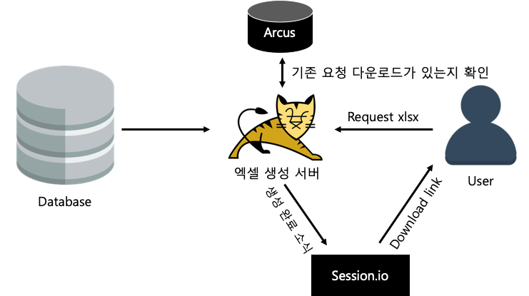
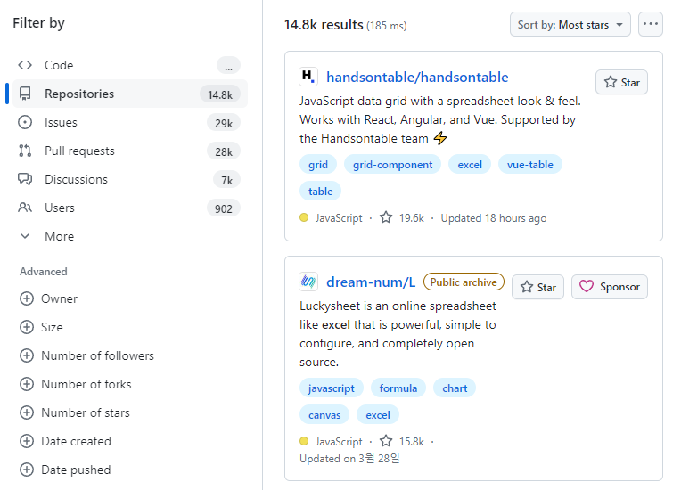

# 대량 XLSX 파일 다운로드

- https://d2.naver.com/helloworld/9423440

일반적인 웹 페이지는 페이징을 사용하여 해당 데이터가 어떤 기간에 생성되었든 한 페이지에 표시할 수 있는 내용만 표시한다.

하지만, XLSX 파일은 사용자가 원하는 기간 또는 원하는 상태에 해당하는 모든 데이터를 포함한다. 따라서 데이터의 최대 크기를 알고 있는 페이징과 달리 데이터의 최대 크기를 알 수 없다. 대량의 ROW의 데이터 다운로드를 시도하면 OOM(Out of memory)가 발생할 수 있다.

## XLSX 파일 표준

XLSX 파일의 형식은 OOXML(Open Office XML)이다. PPTX, DOCX 파일도 OOXML 형식을 사용한다. OOXML은 이름처럼 XML을 기반으로 데이터를 저장하고 표현한다.
- XLSX 파일은 여러 XML 파일을 포함하는 폴더를 압축한 파일이다.
- XLSX 파일의 확장자를 .zip으로 변경한 뒤 압축을 해제하면 여러 XML 파일이 포함된 폴더를 확인할 수 있다.
  - {sheetName}.xml: 해당 파일에는 필요한 정보 외에 XML 오버헤드도 굉장히 많다. ROW 몇만 개의 정보를 모두 메모리에 올리면 위험한 상태가 된다. 해당 파일은 Stream 처리가 되어야 한다.
  - style.xml: 서식 정보는 해당 파일에 저장된다. 복잡하고 화려한 서식이 아니라면 해당 파일은 신경쓰지 않아도 된다.

## 기존 XLSX 파일 생성 구조

네이버에서는 기존에 MyBatis의 resultHandler에서 ROW 한 개씩 XLSX 파일에 작성하고 XLSX 파일 생성이 완료되면 네이버의 세션 관리, 메시지 전달 사내 플랫폼인 Session.io에 이를 알려준다. 그러면, Session.io는 사용자의 브라우저에 푸시하여 XLSX 파일을 다운로드하게 한다.  
해당 방법으로 한 요청이 Tomcat 쓰레드를 오래 차지하지 않게 한다. 또한, 서버가 XLSX 파일을 생성하는 동안 사용자가 반응을 못 알아차리고, 한 번 더 클릭하는 일을 방지하기 위해, 네이버에서 오픈소스화한 메모리 캐쉬 클래우드(Arcus)에 XLSX 파일을 생성하고 있다는 정보를 담는다.  

<div align="center">
    
</div>
<br/>

### 개선 사항

 - 첫 번째 방법: 기존 그대로 사용
   - 중간 진행 단계를 사용자가 알 수 없다. 사용자는 XLSX 파일 생성이 완료되어야지만 다운로드 링크를 받고 다운로드 할 수 있다.
   - 또한, API 서버 코드에 현재 없는 사용자와 직접 맞닿는 API가 들어가야 한다.
   - 또, XLSX 파일 생성에 Arcus나 Session.io와 같은 외부 의존성이 필요하다.
 - 두 번째 방법: XLSX 파일을 생성하는 서버를 새로 만든다.
   - API 서버 코드에 직접적으로 XLSX 파일을 만드는 API가 들어가지 않아도 되어 API 서버 관리가 쉽고, API 서버에서 해당 API의 의존성을 제거할 수 있다.
   - Tomcat 앞에 Node.js를 추가하여, Node.js에서 API 서버를 호출하여 XLSX 파일을 생성할 수 있다면 Node.js에서 생성하는 것이 다른 API들처럼 각종 인증 처리와 포매팅 처리를 Node.js에서 할 수 있다.

<div align="center">
    
</div>
<br/>

## JavaScript로 XLSX 파일 생성하기

Java 진영에서는 POI 라이브러리가 거의 표준으로 사용된다. JavaScript 진영에서 사용되는 Excel 라이브러리를 찾기 위해서는 Github을 이용할 수 있다.  
 - Github에서 Excel을 검색 후 Languages 옵션으로 JavaScript를 검색한다. 이후 Most start 순서로 정렬하여 확인한다.
 - ExcelJS는 JavaScript에서 Streaming을 제공한다.

<div align="center">
    
</div>
<br/>

POI는 sheet.xml 파일을 임시 파일에 쓴다. 때문에, Response Stream에 바로 XLSX 파일을 작성할 수 없다.  
대용량 Excel 다운로드시 ExcelJS는 다운로드 창이 바로 나타나지만, POI는 다운로드 창이 나타나는데 시간이 걸린다. POI를 사용한 경우 사용자 입장에서 버튼 클릭 후 몇 초간 아무 반응을 얻을 수 없다. ExcelJS를 사용하면 버튼 클릭 즉시 다운로드 창이 나타나 즉각적인 반응을 보여준다는 측면에서 더 나은 사용성을 제공한다.  

## Tomcat에서 Node.js로 데이터 주기

페이징에 필요한 ORDER BY는 데이터베이스에 계속해서 전체 레코드를 정렬하고 이는 느린 쿼리가 많은 XLSX 파일 생성에 적합하지 않다.  
한 번의 I/O로 필요한 모든 ROW를 가져오기 위해서는 페이징에 사용된 LIMIT 절만 삭제하면 된다. 하지만, 모든 ROW가 메모리에 들어와 이는 곧 OOM 위험이 있다.  
따라서, I/O는 한 번만 발생하면서 모든 ROW를 메모리에 올리지는 않을 수 있어야 한다.  

### Node.js로 ROW 한 개씩 Streaming

 - spring-webflux는 해당 구조를 지원한다.
   - Flux를 Controller에서 반환하면 NDJSON 형태로 데이터가 스트리밍된다.
   - NDJSON은 "\n"(new line)으로 ROW를 쪼개는 형식이다.
```java
@GetMapping(path="/coupons-stream", produces=APPLICATION_NDJSON)
public Flux<CouponDto> getCouponStream(CouponSearchParams params) {  
    return couponSearchService.findFlux(params)
        .map(CouponDto::from);
}
```

 - Node.js에서는 data 이벤트마다 XLSX 파일에 ROW를 Flush 하도록 하면 된다.
```javascript
const jsonStream = JSONStream();  
jsonStream.on('data', json => {  
    excelUtil.writeRow(sheet, json, formatter)
});
```

### 데이터베이스에서 ROW를 한 개씩 가져오기

행이 몇 개일지 모르는 쿼리 결과를 OOM을 회피하며 스트리밍하고 싶지만, 이러한 기능이 없다.  
이 기능을 만들어 내기 위해 쓰레드를 하나 더 사용하였고, 이때 Producer & Consumer 모델을 사용해 해당 기능을 제공한다.  

<div align="center">
    
</div>
<br/>

Producer는 데이터베이스에서 ROW를 가져오고 Consumer는 Producer가 가져온 ROW를 가져간다. 이때, Consumer와 Producer는 BlockingQueue를 통해서 통신한다. 데이터베이스에 Back Pressure를 따로 줄 수 없기 때문에 Blocking Queue가 꽉 차 있는 경우 INSERT하는 쓰레드를 재우는 형식으로 Back Pressure 역할을 대신한다. 이를 통해 Consumer가 처리할 능력이 되지 않음에도 Producer가 메모리에 데이터를 무작정 넣는 일이 없도록 방지한다.  
 - https://github.com/naver/spring-jdbc-plus/blob/main/spring-data-jdbc-plus-sql/src/main/java/com/navercorp/spring/data/jdbc/plus/sql/support/template/JdbcReactiveTemplate.java

